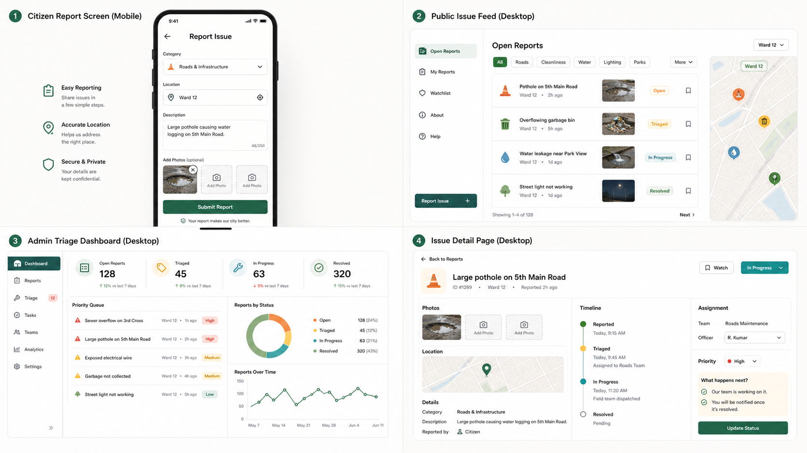

# UI/UX Design Direction

## Reference Snapshot

Use this generated concept sheet as the visual north star for the Civic Issue Reporter UI:



Saved asset:

```text
docs/design-references/ui-ux-concept-sheet-001.png
```

## Direction

The app should feel refreshing, simple, minimal, and civic-minded without becoming plain or generic.

Use:

- generous spacing and clear hierarchy
- off-white surfaces with ink-black text
- muted civic green and teal as primary accents
- soft amber and restrained coral for priority or warning states
- compact, useful cards and panels
- simple status chips and timelines
- practical admin density without visual clutter
- mobile-first citizen reporting

Avoid:

- heavy gradients
- decorative orbs, blobs, or bokeh
- fake government seals or official-looking logos
- dark mode as the primary direction
- nested cards inside cards
- cluttered dashboards
- purple-blue dominant SaaS styling
- decorative illustration that competes with workflows

## Intended Screens

Future UI tickets should implement the concept in this order:

1. Citizen report screen.
2. Public issue feed.
3. Admin triage dashboard.
4. Issue detail and progress timeline.

## Implementation Note

Treat this as a design reference, not a pixel-perfect screenshot. Preserve the visual intent: minimal, warm, structured, useful, and civic.
