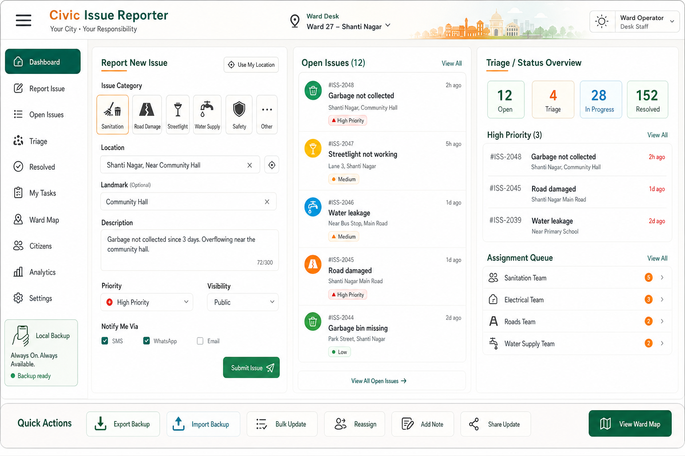

# UI/UX Design Direction

## Reference Snapshot

Use this generated concept sheet as the visual north star for the Civic Issue Reporter UI:


Use this newer generated panel refresh as the current visual direction for the next UI pass:



Saved asset:

```text
docs/design-references/ui-ux-concept-sheet-001.png
docs/design-references/ui-ux-indian-civic-panel-refresh-001.png
```

## Direction

The app should feel refreshing, simple, modern, and clearly civic-minded for Indian municipal workflows without becoming plain, generic, or falsely official.

Use:

- generous spacing and clear hierarchy
- off-white surfaces with ink-black text
- deep civic green and teal as primary accents
- warm saffron/orange as an energetic civic action accent
- small sky-blue accents for map/location/readiness affordances
- soft amber and restrained coral for priority or warning states
- compact, useful cards and panels
- quick action panels instead of overloaded all-in-one dashboards
- simple status chips and timelines
- practical admin density without visual clutter
- mobile-first citizen reporting
- familiar Indian civic wording such as ward, area, landmark, desk, queue, and team routing

Avoid:

- heavy gradients
- decorative orbs, blobs, or bokeh
- fake government seals or official-looking logos
- Ashoka emblem, official seals, political symbols, and flag-as-logo treatment
- dark mode as the primary direction
- nested cards inside cards
- cluttered dashboards
- purple-blue dominant SaaS styling
- decorative illustration that competes with workflows

## Intended Screens

Future UI tickets should implement the panel refresh in this order:

1. Citizen report screen.
2. Quick panel shell and navigation.
3. Public issue feed.
4. Admin triage dashboard.
5. Issue detail and progress timeline.

## Implementation Note

Treat this as a design reference, not a pixel-perfect screenshot. Preserve the visual intent: minimal, warm, structured, useful, and civic.
